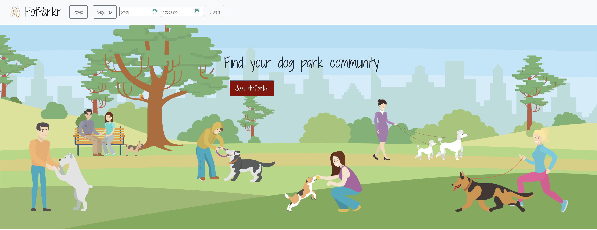
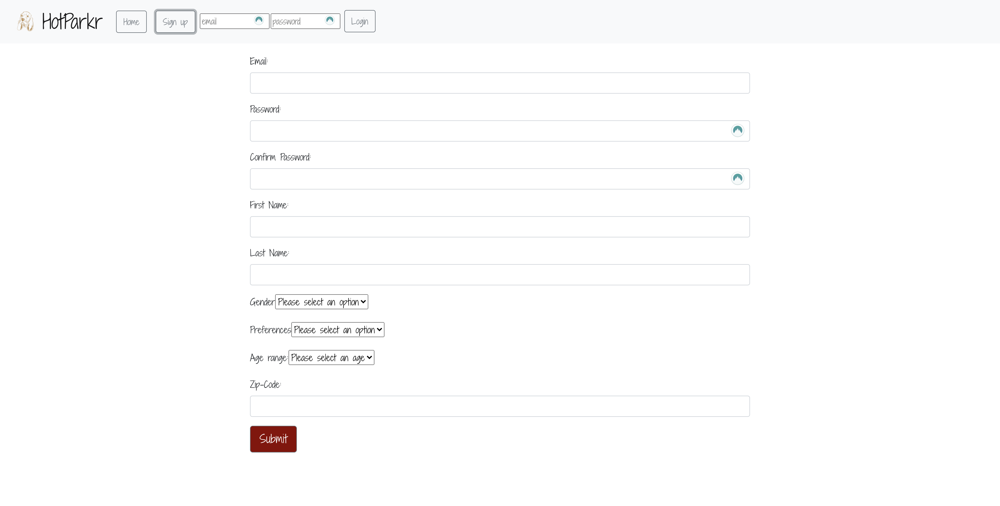
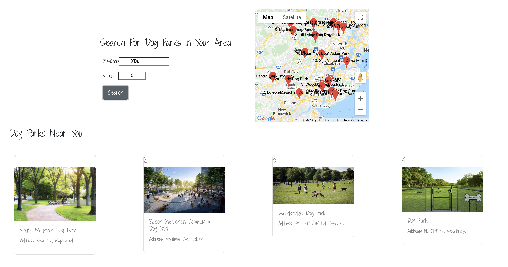
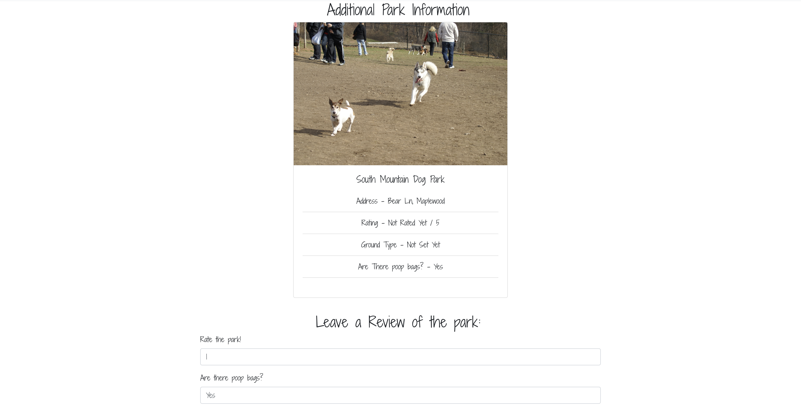
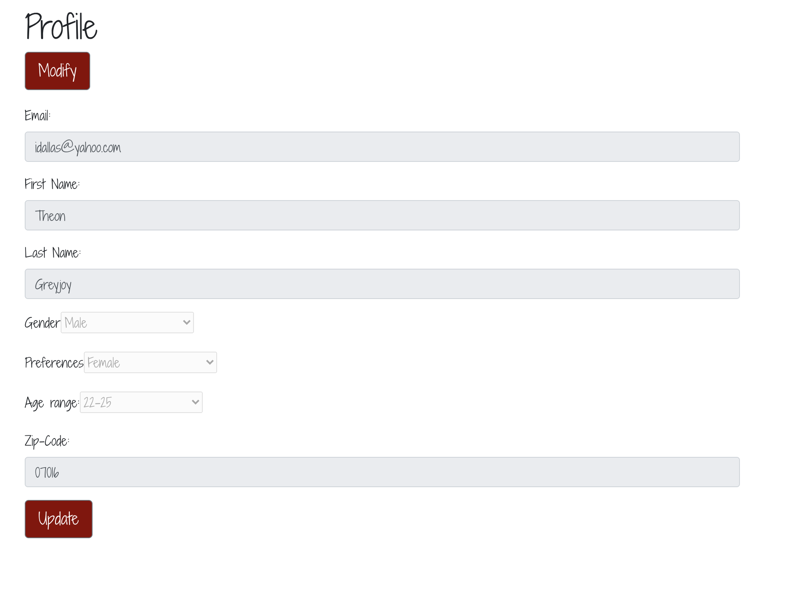

## Description

HotParkr is a fullstack MERN social connection app based on the dog park community. It is hard to meet new people generally but much easier to do so when dogs are involved, you're socially distanced, and outside at a local dog park. HotParkr allows users to find dog parks near them, find information about their local dog parks, blog about those parks, and most importantly connect with other users who frequent the local dog parks to form a dog park community! 

  

## Table of Contents

- [Description](#description)
- [Installation](#Installation)
- [Usage](#usage)
- [Questions](#questions)
- [Credits](#credits)
- [License](#license)

## Installation

HotParkr is a fully deployed application, to use it and find dark parks near you follow this link [HotParkr](https://project-three-skirk.herokuapp.com/).

## Usage

### First the user signs up or logs into HotParkr. 

### After you sign up/ log in use the search feature to search for dog parks located near a zipcode of your choice and set your search radius. Depending on where you are, dog parks will populate onto the page. 

### Each dog park page includes information about that dog park/ allows users to add information about the dog park and leave a review/ rating. 

### After creating a user profile, a user can also edit their information.

## Questions

Please direct any questions to [info@HotParkr.com](mailto:Dallas.Isaac1@gmail.com)

## Credits

[Isaac Dallas](https://github.com/idallas93)

[Sahar Vacnich](https://github.com/saharVac)

[Keith Fung](https://github.com/ikeifu)

[Rohan Chitrakar](https://github.com/roan1088)

[Karen Kaltenheuser](https://github.com/kkaltenheuser)

## License

